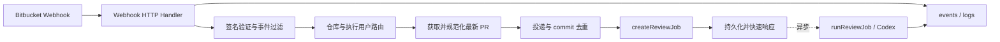
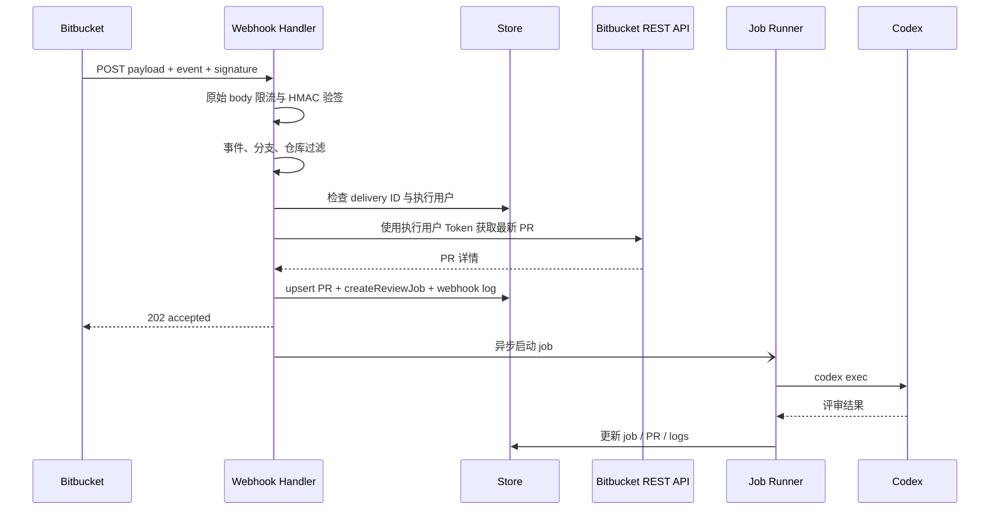
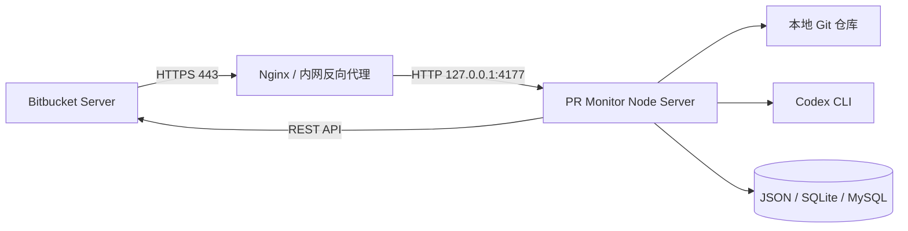

# Bitbucket Webhook 触发 PR 评审方案

生成日期：2026-08-14

## 1. 目标与范围

在现有 PR Monitor 中增加一个平台级 Bitbucket Webhook 入口，使 PR 创建或源分支更新时能够立即同步 PR，并按配置创建或执行 Codex 评审任务。

第一期目标：

- 支持 Bitbucket Server / Data Center 的 PR Webhook。
- 支持 `pr:opened` 和 `pr:from_ref_updated` 两类事件。
- 验证 Webhook Secret 签名。
- 根据仓库配置确定执行用户和本地仓库路径。
- 按 `PR + commit` 去重，复用现有 `createReviewJob()` 和 `runReviewJob()`。
- 在管理界面配置端点、事件、分支、执行动作和仓库归属。
- 在现有日志系统展示投递结果。

第一期不做：

- 不为每个仓库生成独立服务端端点。
- 不保存原始 Webhook 请求体。
- 不在页面保存或返回 Webhook Secret 原值。
- 不新增数据库业务表。
- 不让 Webhook 请求同步等待 Codex 执行完成。
- 不承诺 Electron 默认的随机本地端口可直接接收远程 Webhook。

## 2. 当前架构与扩展原则

当前项目是 Node.js 22+ 单体服务：

- `server.mjs`：HTTP API、存储适配、Bitbucket API、调度器、任务执行和日志。
- `public/`：无框架的 HTML、CSS 和浏览器 JavaScript。
- 存储：本地 JSON、SQLite、MySQL/MariaDB，共享同一个规范化 Store 模型。
- PR、任务和 Token 按用户隔离。
- `createReviewJob()` 已按用户、PR 和 commit 对运行中或已完成任务去重。

Webhook 能力应作为薄入口复用现有链路，不引入新的任务系统：



## 3. 核心架构决策

### ADR-1：采用单一平台端点

端点：

```text
POST /api/webhooks/bitbucket
```

原因：

- 当前 Bitbucket Base URL、存储和任务执行都是平台级能力。
- 一个端点便于反向代理、监控、Secret 轮换和部署。
- 仓库与用户归属由服务端配置决定，避免 URL 中暴露内部用户信息。

### ADR-2：Secret 与用户 Token 分离

- 用户 Bitbucket Token：出站凭据，用于调用 Bitbucket REST API 和发布评论。
- Webhook Secret：入站凭据，用于验证 Webhook 请求来源。
- Secret 只从环境变量读取，不写入 `store.json`、数据库或 Skill 认证文件。
- Store 只保存环境变量名，例如 `PR_MONITOR_WEBHOOK_SECRET`。

### ADR-3：请求快速返回，评审异步执行

Webhook 请求只完成验签、过滤、路由、同步 PR、创建任务和持久化，然后在 2 秒内返回。

Codex 评审在响应后异步启动，避免 Bitbucket 因超时重复投递。

### ADR-4：复用现有日志，不新增投递表

第一期将每次投递写入现有 `logs`，使用 `type=webhook-*` 和结构化 `detail`。

SQLite/MySQL 已有日志表，本地 JSON 也会持久化 `logs`，因此无需三套表迁移。

### ADR-5：显式配置仓库执行用户

Webhook 请求没有浏览器登录上下文，不能使用 `currentUser()`。

每个仓库必须明确路由到一个执行用户。默认从 `webhook.repoOwners` 查找；未配置时只允许在唯一候选用户的情况下自动推断，否则忽略并记录路由错误。

## 4. 配置模型

在 `defaultStore().settings` 下增加：

```js
webhook: {
  enabled: false,
  publicBaseUrl: '',
  secretEnvName: 'PR_MONITOR_WEBHOOK_SECRET',
  acceptedEvents: ['pr:opened', 'pr:from_ref_updated'],
  targetBranches: ['*'],
  action: 'run',
  repoOwners: {
    'I18N/plugin-bi-finebi-cli': 'admin'
  },
  maxBodyBytes: 1048576
}
```

字段规则：

- `enabled`：平台总开关。
- `publicBaseUrl`：只用于生成 Bitbucket 配置 URL，不改变监听地址。
- `secretEnvName`：环境变量名；API 只返回是否已配置，不返回值。
- `acceptedEvents`：允许的 `X-Event-Key`。
- `targetBranches`：支持精确名称和尾部 `*`，例如 `main`、`release/*`。
- `action`：`run`、`queue` 或 `sync`。
- `repoOwners`：`PROJECT/repo -> userId`。
- `maxBodyBytes`：防止大请求占用内存，默认 1 MiB。

环境变量：

```text
PR_MONITOR_WEBHOOK_SECRET=<实际随机密钥>
HOST=0.0.0.0
PORT=4177
```

页面和日志中禁止输出实际 Secret。

## 5. API 设计

### 5.1 公共 Webhook API

```text
POST /api/webhooks/bitbucket
```

请求要求：

- `Content-Type: application/json`
- `X-Event-Key: pr:opened` 或 `pr:from_ref_updated`
- Bitbucket 签名 Header，格式按部署版本确认后实现；目标格式为 `sha256=<hex>`。
- 原始请求体必须在 JSON 解析前完成 HMAC-SHA256 验证。

响应契约：

```json
{
  "ok": true,
  "outcome": "accepted",
  "deliveryId": "request-id-or-generated-id",
  "pr": "I18N/plugin-bi-finebi-cli#93",
  "jobId": "uuid"
}
```

状态码：

- `202`：已创建任务或已进入队列。
- `200`：事件被规则忽略或已去重。
- `400`：JSON 或 PR 载荷无效。
- `401`：签名缺失或不匹配。
- `404`：仓库未配置执行用户时可返回通用未处理结果；外部响应不暴露用户信息。
- `413`：请求体超过上限。
- `503`：Webhook 已启用但 Secret 环境变量不存在。

### 5.2 管理 API

仅 `admin` 或 `super-admin` 可访问：

```text
GET  /api/webhooks/settings
POST /api/webhooks/settings
GET  /api/webhooks/deliveries?limit=100
POST /api/webhooks/test
```

`GET /api/webhooks/settings` 返回：

```json
{
  "enabled": true,
  "publicBaseUrl": "https://pr-monitor.example.com",
  "endpointUrl": "https://pr-monitor.example.com/api/webhooks/bitbucket",
  "secretEnvName": "PR_MONITOR_WEBHOOK_SECRET",
  "secretConfigured": true,
  "acceptedEvents": ["pr:opened", "pr:from_ref_updated"],
  "targetBranches": ["release/*", "main"],
  "action": "run",
  "repoOwners": {
    "I18N/plugin-bi-finebi-cli": "admin"
  }
}
```

`POST /api/webhooks/test` 只验证配置、路由、分支规则和去重键，不调用 Codex、不发布 Bitbucket 评论。

## 6. 原始请求体与验签

现有 `readJsonBody()` 会直接拼接并解析 JSON，无法可靠进行签名验证。应拆成：

```js
async function readRawBody(request, maxBytes) {
  const chunks = [];
  let size = 0;
  for await (const chunk of request) {
    size += chunk.length;
    if (size > maxBytes) throw new HttpError(413, 'Payload too large');
    chunks.push(chunk);
  }
  return Buffer.concat(chunks);
}

function parseJsonBuffer(rawBody) {
  return rawBody.length ? JSON.parse(rawBody.toString('utf8')) : {};
}
```

验签必须：

1. 从配置中取得环境变量名。
2. 从 `process.env[secretEnvName]` 读取 Secret。
3. 对原始 Buffer 计算 HMAC-SHA256。
4. 解析签名 Header 的 `sha256=` 前缀。
5. 检查长度后使用 `crypto.timingSafeEqual()` 比较。
6. 失败时只记录 Header 是否存在、请求字节数、事件类型和请求 ID，不记录 Secret、完整签名或原始 body。

在开发前必须用目标 Bitbucket Server/Data Center 版本确认实际签名 Header 名称和格式，并以该版本的真实投递样本建立集成测试夹具。

## 7. 事件解析与用户路由

### 7.1 统一事件对象

Webhook payload 先转换为内部对象：

```js
{
  deliveryId,
  eventKey,
  project,
  repo,
  prId,
  title,
  fromCommit,
  fromBranch,
  toBranch,
  author,
  reviewers
}
```

业务代码不直接依赖原始 payload 深层结构。

### 7.2 执行用户解析顺序

1. 精确匹配 `settings.webhook.repoOwners[PROJECT/repo]`。
2. 若未配置，查找 `repoPathMappings` 中精确包含该仓库的用户。
3. 若仍未找到，使用 payload reviewer 与用户 `bitbucketNames` 匹配。
4. 只有一个候选用户时才允许继续。
5. 多个或零个候选时返回 `ignored: owner-unresolved`，不使用当前页面用户兜底。

执行用户必须同时满足：

- 用户存在且未被删除。
- 已配置 Bitbucket Token。
- 能解析到可读的本地 Git 仓库。

## 8. PR 同步与任务去重

新增内部函数：

```text
upsertWebhookPr(store, rawPr, owner, eventContext)
```

处理顺序：

1. 使用执行用户 Token 调用 Bitbucket PR 详情 API，不能完全信任 Webhook payload。
2. 使用现有 `normalizePr()` 和 `reviewSignalForPr()` 生成规范化 PR。
3. 使用 `recordKey(owner.id, displayKey)` 写入用户隔离的 PR。
4. 更新 `fromCommit`、分支、URL、状态和 `lastSeenAt`。
5. 计算去重键：

```text
delivery:<Bitbucket request id>
review:<ownerUserId>:<PROJECT/repo#prId>:<fromCommit>
```

去重规则：

- 相同 delivery ID：直接返回 `duplicate-delivery`。
- 同一 commit 已有 queued/running：返回现有任务。
- 同一 commit 已有 done：返回 `already-reviewed`。
- 同一 commit 只有 failed/blocked：默认不自动无限重试，记录 `previous-failure`；由配置或人工重试决定。
- 新 commit：允许创建新任务。

现有 `createReviewJob()` 已覆盖 queued/running/done 去重，但 Webhook 层必须额外处理 delivery ID 和 failed/blocked 重复投递。

## 9. 请求时序



## 10. 并发与一致性

当前存储写入采用“读取整个 Store → 修改 → 覆盖写回”，Webhook、定时同步和人工操作同时执行时存在丢失更新风险。

第一期应增加进程内写锁：

```text
withStoreMutation(async store => { ... })
```

至少以下路径使用同一个锁：

- Webhook PR upsert 和任务创建。
- `syncPrs()` 的 PR 更新和任务创建。
- 人工创建、重试、删除任务。
- 用户或平台设置更新。

锁内只处理 Store 读写；Bitbucket HTTP 请求和 Codex 执行不得长期占用锁。推荐顺序：读取必要配置 → 外部请求 → 获取锁 → 重新读取 Store → 校验去重 → 写入。

第一期只保证单进程一致性。多实例部署需要数据库唯一约束或分布式锁，不在本期范围内。

## 11. 日志与可观测性

每次投递产生一条结构化日志：

```js
{
  type: 'webhook-accepted',
  level: 'info',
  detail: {
    deliveryId,
    eventKey,
    project,
    repo,
    prId,
    fromCommit,
    outcome,
    reason,
    userId,
    jobId,
    durationMs,
    bodyBytes
  }
}
```

日志类型：

- `webhook-accepted`
- `webhook-ignored`
- `webhook-duplicate`
- `webhook-rejected`
- `webhook-failed`

不得记录：

- Secret 或 Token。
- 完整签名 Header。
- 原始请求体。
- PR 中可能包含的完整敏感描述。

“最近投递”页面从 `logs` 中筛选 `webhook-*` 类型，最多返回 100 条。

## 12. 管理界面

新增：

```text
public/webhooks.html
public/webhooks.js
```

导航入口只对平台管理员显示。

页面分为两个标签：

### 配置

- 启用 Webhook。
- 外部访问地址和生成后的 Webhook URL。
- Secret 环境变量名和“已配置/未配置”状态。
- 事件选择。
- 目标分支规则。
- 命中动作：立即执行、只排队、仅同步。
- 仓库到执行用户映射。
- 检测配置和无副作用测试。

### 最近投递

- 时间、事件、仓库、PR、commit。
- accepted / ignored / duplicate / rejected / failed。
- 原因和关联任务。
- 可跳转到任务或事件日志。

页面必须明确提示：

- `127.0.0.1`、`localhost` 不能被远程 Bitbucket 访问。
- `publicBaseUrl` 只生成地址，不会自动开放端口或配置反向代理。
- Electron 默认使用随机 localhost 端口，不能作为稳定远程端点。

## 13. 部署拓扑

推荐 Web 运行模式：



运行要求：

- PR Monitor 使用固定端口。
- Nginx 只转发 `/api/webhooks/bitbucket` 和需要的管理页面/API。
- 外部使用 HTTPS。
- 配置安全组、防火墙和内网 ACL。
- 反向代理必须原样传递签名 Header 和请求体，不能重写 JSON。
- 仅当 Bitbucket 能访问目标地址时才在 UI 显示“已收到真实投递”。

本地开发可使用公司批准的安全隧道，但不能把临时隧道作为生产方案。

## 14. 实现文件拆分

为避免继续膨胀 `server.mjs`，建议新增：

```text
server/
  webhook-config.mjs
  webhook-signature.mjs
  webhook-event.mjs
  webhook-service.mjs
public/
  webhooks.html
  webhooks.js
```

职责：

- `webhook-config.mjs`：默认值、配置归一化、敏感字段屏蔽。
- `webhook-signature.mjs`：原始 body、大小限制、签名解析和常量时间比较。
- `webhook-event.mjs`：Bitbucket payload 转内部事件对象。
- `webhook-service.mjs`：过滤、路由、PR upsert、去重、任务创建和投递日志。
- `server.mjs`：只注册路由并注入现有 Store、Bitbucket 和任务函数。

若第一期不做模块拆分，也必须至少把上述职责实现为独立纯函数，便于测试。

## 15. 分阶段开发计划

### 阶段 1：安全入口与纯函数

- 增加配置默认值与归一化。
- 增加 `readRawBody()` 和请求大小限制。
- 实现签名验证、事件解析、分支匹配。
- 添加 Node 内置测试。

### 阶段 2：业务接入

- 实现仓库到用户路由。
- 实现最新 PR 拉取和 upsert。
- 增加 delivery 与 commit 去重。
- 复用 `createReviewJob()`。
- 响应后异步调用 `runReviewJob()`。
- 加入 Store 写锁。

### 阶段 3：管理页面

- 新增 Webhook 配置页面。
- 增加管理 API、最近投递列表和测试配置。
- 增加导航与权限控制。

### 阶段 4：部署与真实联调

- 更新 `.env.example` 和 README。
- 提供 Nginx 示例。
- 在目标 Bitbucket 建立 Webhook。
- 验证签名 Header、事件 payload、网络和真实重复投递行为。

## 16. 测试策略

项目当前没有自动化测试脚本。建议使用 Node 内置 `node:test`，避免引入新测试依赖：

```json
{
  "scripts": {
    "test": "node --test"
  }
}
```

### 单元测试

- 正确签名通过。
- 缺失、错误、长度异常签名失败。
- body 超过限制返回 413。
- 原始字节变化导致验签失败。
- 支持的事件转换正确。
- 未支持事件被忽略。
- `release/*`、精确分支和 `*` 匹配。
- 仓库执行用户唯一解析。
- 多用户冲突不使用当前用户兜底。
- 相同 delivery ID 去重。
- 相同 PR 和 commit 去重。
- 新 commit 允许新任务。

### HTTP 集成测试

- Webhook 关闭时不创建任务。
- Secret 未配置返回 503。
- 无效签名返回 401 且不写 PR/任务。
- 有效事件返回 202 并持久化 PR 与任务。
- 忽略事件返回 200。
- 重复投递返回 200 duplicate。
- Webhook 响应不等待 Codex 完成。
- 管理 API 拒绝普通用户。
- 配置 API 不返回 Secret 原值。

### 存储回归

- 本地 JSON 保存并重载 Webhook 配置。
- SQLite 保存并重载 Webhook 配置和日志。
- MySQL 保存并重载 Webhook 配置和日志。
- 存储迁移前后用户、PR、任务和日志数量一致。

### 真实联调

- Bitbucket PR 创建产生一次任务。
- Bitbucket 重试相同 delivery 不产生第二个任务。
- 新 commit 产生新任务。
- 修改标题不触发评审。
- 无效 Secret 被拒绝。
- Nginx 转发后签名仍有效。

## 17. 验收标准

- 管理员能够保存 Webhook 配置，但 API 和日志中不存在 Secret 原值。
- Bitbucket 能在 2 秒内收到有效响应。
- PR 创建和源分支更新能创建正确用户下的任务。
- 同一 delivery 和同一 commit 不会重复创建任务。
- 新 commit 可以重新评审。
- 不支持事件、分支不匹配、路由失败均有明确日志且不会运行 Codex。
- Webhook 创建的任务与人工任务使用同一执行、状态和结果页面。
- JSON、SQLite、MySQL 三种存储模式行为一致。
- Electron 页面明确显示远程 Webhook 限制。
- 所有签名、路由、去重和 HTTP 集成测试通过。

## 18. 主要风险与待确认项

1. **Bitbucket 版本差异**：实现前确认目标版本的签名 Header 与事件 payload。
2. **公网或内网可达性**：本地服务默认只监听 `127.0.0.1`，必须有固定可达入口。
3. **全量 Store 覆盖写**：未加入写锁前可能与定时任务并发丢数据。
4. **多用户归属**：禁止使用页面当前用户隐式兜底，必须明确配置或唯一推断。
5. **失败任务重投**：Bitbucket 重试不能导致失败任务无限自动重跑。
6. **Secret 轮换**：第一期只支持单 Secret；需要无中断轮换时再增加 current/previous 双 Secret。
7. **桌面版生命周期**：Electron 退出即关闭服务，不适合作为长期 Webhook 接收器。

## 19. 推荐第一期交付边界

第一期建议只交付：

- 单一平台端点。
- 单 Secret 环境变量。
- 两类 PR 事件。
- 仓库到用户显式映射。
- `run / queue / sync` 三种动作。
- 基于现有日志的最近投递。
- 单进程写锁和去重。
- Web 模式部署说明。

完成这一边界后，再评估多端点、多 Secret 轮换、多实例部署和自动管理 Bitbucket Webhook。
